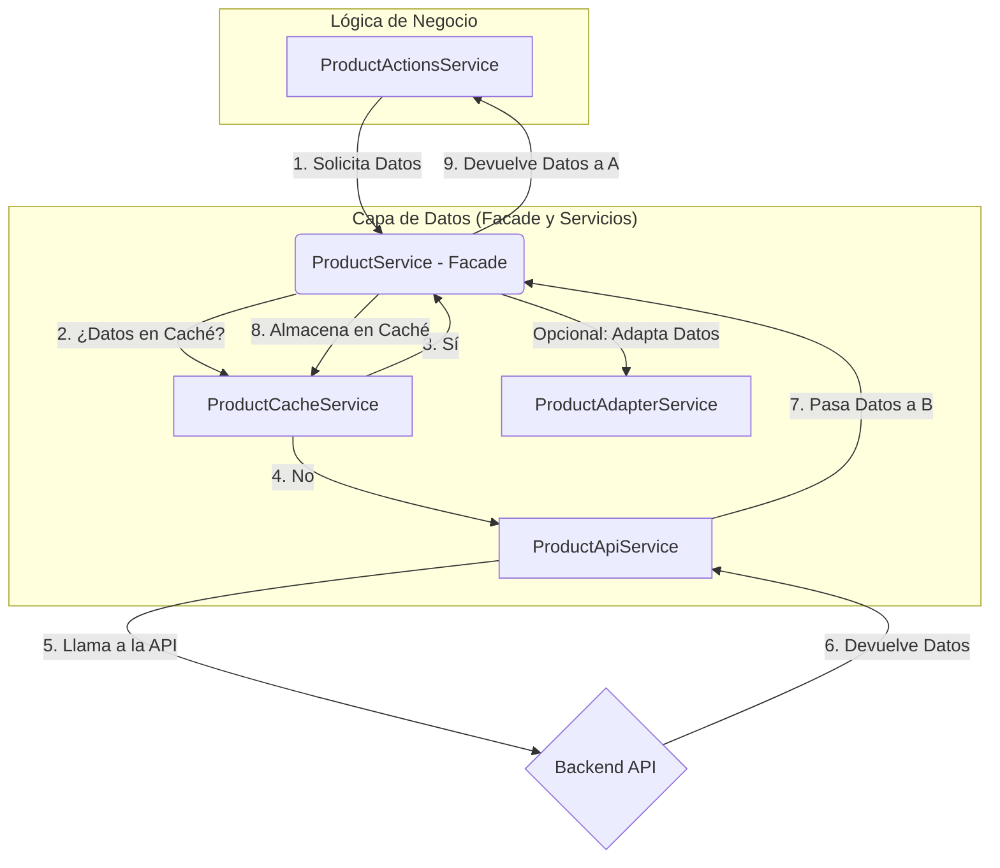

# Informe de Análisis del Frontend - Proyecto "Grupo Apícola"

### **1. Resumen Ejecutivo (Versión Detallada)**

El frontend del proyecto "Grupo Apícola" es una Single-Page Application (SPA) de alto rendimiento, construida sobre la última versión de **Angular (v17)**. La aplicación se divide en dos áreas funcionales principales: un portal público para clientes y un panel de administración privado y protegido, diseñado para la gestión integral del negocio. El objetivo principal de la arquitectura es ofrecer una experiencia de usuario segura, reactiva y extremadamente rápida.

A nivel arquitectónico, el proyecto implementa de manera pragmática un **diseño dual**. Para funcionalidades complejas como la **Gestión de Productos**, que requiere filtros dinámicos, paginación y búsqueda, se utiliza un patrón de **gestión de estado (State Management) personalizado**. Este patrón, inspirado en soluciones como NgRx, utiliza `BehaviorSubjects` de RxJS para crear un `Store` centralizado (`ProductStore`) que actúa como única fuente de verdad, un `ActionsService` que orquesta las operaciones y un `Facade Service` que coordina la capa de datos. Este enfoque garantiza un flujo de datos predecible y una excelente mantenibilidad. Para secciones más sencillas, como la lista de ventas, se opta por un flujo de datos más directo entre el componente y el servicio, evitando así la complejidad innecesaria.

La **seguridad** es un pilar fundamental y se implementa siguiendo las mejores prácticas de la industria. La autenticación se basa en **JSON Web Tokens (JWT)**, que se persisten en `localStorage` para mantener la sesión del usuario. Un `AuthService` centraliza toda la lógica de autenticación, mientras que los guardianes de ruta (`authGuard` y `adminGuard`) protegen el acceso a las páginas basándose en el estado de autenticación y el rol del usuario ('administrador'). La robustez del sistema se ve reforzada por un **interceptor HTTP global** que adjunta automáticamente el token de autorización a cada petición y gestiona de forma centralizada los errores de sesión (código 401), redirigiendo al usuario al login y previniendo estados inconsistentes en la aplicación.

El **rendimiento** ha sido una prioridad clave en el desarrollo. La aplicación utiliza **carga perezosa (lazy loading)** a nivel de rutas, lo que significa que el código de módulos enteros (como el panel de administración) solo se descarga cuando es necesario, reduciendo drásticamente el tiempo de carga inicial. Además, se ha implementado una **capa de caché en memoria inteligente** que almacena las respuestas de la API y las invalida automáticamente tras operaciones de escritura (creación, actualización, eliminación), minimizando las llamadas a la red. La interfaz de usuario también está optimizada, utilizando técnicas como `debounceTime` en los campos de búsqueda para evitar peticiones excesivas al backend.

En conclusión, el frontend del proyecto "Grupo Apícola" no es simplemente una interfaz de usuario, sino una plataforma de software bien diseñada. Su arquitectura modular, su enfoque en la seguridad y el rendimiento, y la aplicación inteligente de patrones de diseño avanzados la convierten en una base sólida, escalable y fácil de mantener para el futuro crecimiento del proyecto.

---

### **2. Pila Tecnológica (Technology Stack)**

El frontend del proyecto "Grupo Apícola" se ha construido utilizando un conjunto de tecnologías modernas y consolidadas, seleccionadas para maximizar la productividad del desarrollador, el rendimiento de la aplicación y la calidad del código.

#### **2.1. Core del Framework**

*   **Angular 17**: Es el corazón de la aplicación. Su versión más reciente introduce mejoras clave como los **Standalone Components** (componentes autónomos), un nuevo flujo de control en las plantillas (`@if`, `@for`) y un sistema de carga perezosa más eficiente. La elección de Angular proporciona una estructura robusta, un potente sistema de inyección de dependencias y un ecosistema completo para construir aplicaciones a gran escala.
*   **TypeScript**: Como lenguaje de programación principal, añade un sistema de tipado estático a JavaScript. Esta característica es fundamental para mejorar la calidad del código, ya que permite detectar errores en tiempo de compilación, facilita la refactorización y resulta en una aplicación más fiable y mantenible.
*   **RxJS (Reactive Extensions for JavaScript)**: Librería esencial en el ecosistema de Angular para gestionar la asincronía y los eventos mediante flujos de datos (Observables). En este proyecto, es la base para la comunicación con la API, la gestión de estado reactiva y la implementación de funcionalidades de UI optimizadas, como el **debounce** en la búsqueda (una técnica que retrasa la ejecución de una acción hasta que el usuario deja de escribir, evitando así peticiones innecesarias a la red).

#### **2.2. Estilos y UI (Interfaz de Usuario)**

*   **Bootstrap 5**: Framework CSS principal para la maquetación y los componentes de la interfaz. Proporciona un sistema de rejilla (grid) responsivo y una amplia gama de componentes pre-diseñados (botones, modales, formularios), lo que acelera el desarrollo de una interfaz limpia y adaptable a diferentes dispositivos.
*   **SCSS (Sassy CSS)**: Preprocesador de CSS que permite escribir hojas de estilo de manera más organizada y potente. Funcionalidades como variables, anidamiento y mixins facilitan la creación de un código CSS modular y fácil de mantener.
*   **Lucide Angular**: Librería de iconos SVG ligeros, consistentes y personalizables. El sistema de importación selectiva (`pick`) que se utiliza ayuda a mantener el tamaño final del paquete de la aplicación optimizado.

#### **2.3. Herramientas y Librerías Adicionales**

*   **Angular CLI (Command Line Interface)**: Herramienta de línea de comandos indispensable para el desarrollo con Angular. Se utiliza para generar artefactos del proyecto (componentes, servicios), así como para construir, servir y probar la aplicación.
*   **jwt-decode**: Librería ligera para decodificar el payload de los JSON Web Tokens (JWT) en el cliente. Se utiliza en el `AuthService` para extraer de forma segura la información del usuario (como su rol y nombre) directamente del token.
*   **ngx-pagination**: Librería de Angular que simplifica la implementación de controles de paginación en las listas de datos, como se observa en la gestión de productos.
*   **jspdf & jspdf-autotable**: Librerías para la generación de reportes en formato PDF directamente en el navegador. Permiten crear documentos con tablas y estilos personalizados, una funcionalidad clave para exportar datos como listas de ventas o inventarios.

---

### **3. Arquitectura General**

La arquitectura del frontend está diseñada para ser modular, escalable y fácil de mantener. Sigue las mejores prácticas recomendadas por el equipo de Angular, con una clara separación de responsabilidades entre las diferentes partes de la aplicación.

#### **3.1. Estructura de Carpetas**

La organización del código fuente (`src/app`) es fundamental para la mantenibilidad del proyecto. La estructura principal es la siguiente:

*   **`core/`**: Contiene la lógica central y los servicios que son únicos y se utilizan en toda la aplicación (singletons). Esta es la carpeta más importante para la lógica de negocio transversal.
    *   `auth/`: Lógica de autenticación y seguridad (`AuthService`, `auth.guard`, `admin.guard`).
    *   `interceptors/`: Interceptores HTTP, como el `authInterceptor` que adjunta los tokens JWT.
    *   `models/`: Definiciones de las interfaces y modelos de datos (ej. `product.model.ts`).
    *   `services/`: Servicios de negocio principales que no son específicos de una feature (ej. `sales.service.ts`).

*   **`features/`**: Contiene los módulos de funcionalidades específicas de la aplicación. Cada subcarpeta representa una "característica" principal.
    *   `admin/`: Contiene todo lo relacionado con el panel de administración. A su vez, se subdivide en funcionalidades como `products`, `sales`, `users`, etc.
    *   `public/`: Contendría las páginas y componentes de la parte pública del sitio web.

*   **`shared/`**: Contiene componentes, directivas y pipes que son reutilizables y se comparten entre diferentes módulos de `features`. Por ejemplo, un componente de `ModalDeConfirmacion` o un `SpinnerDeCarga` residirían aquí.

*   **`environments/`**: Contiene los archivos de configuración para los diferentes entornos (desarrollo, producción), como la URL de la API.

#### **3.2. Diagrama de Módulos y Flujo de Datos**

El siguiente diagrama ilustra la relación entre los principales componentes arquitectónicos y cómo fluyen los datos y las acciones del usuario a través del sistema.

```mermaid
graph TD
    subgraph "Navegador del Usuario"
        A[Usuario]
    end

    subgraph "Capa de Presentación (Angular)"
        B(Componentes y Vistas)
        C(Routing de Angular)
    end

    subgraph "Capa de Lógica y Servicios"
        D[Servicios de Acciones]
        E[Servicios Facade]
        F[Store (Estado)]
        G[AuthService & Guards]
        H[HTTP Interceptor]
    end

    subgraph "Backend"
        I{API Externa}
    end

    A -- Interacción --> B;
    B -- Navegación --> C;
    C -- Carga Componente --> B;
    C -- Activa Guards --> G;
    
    B -- Llama a Acción --> D;
    D -- Usa Facade --> E;
    E -- Orquesta --> F;
    D -- Actualiza --> F;
    F -- Emite Estado --> B;

    E -- Petición HTTP --> H;
    H -- Añade Token (de G) --> I;
    I -- Respuesta --> H;
    H -- Devuelve Datos --> E;

```

**Descripción del Flujo:**

1.  El **Usuario** interactúa con los **Componentes**.
2.  La navegación entre vistas es gestionada por el **Routing**, que a su vez utiliza los **Guards** del `AuthService` para proteger las rutas.
3.  Las acciones del usuario en los componentes llaman a los **Servicios de Acciones**.
4.  Estos servicios utilizan los **Facades** para interactuar con la capa de datos.
5.  Los **Facades** orquestan la obtención de datos (a través del **Interceptor HTTP**) y la actualización del **Store**.
6.  El **Store** emite el nuevo estado, y los componentes, al estar suscritos, se actualizan automáticamente.

Esta arquitectura desacoplada asegura que cada parte del sistema tenga una responsabilidad bien definida, lo que facilita las pruebas, la depuración y la futura expansión del proyecto.

---

### **4. Gestión de Estado (State Management)**

Una gestión de estado eficaz es crucial en aplicaciones complejas para mantener la consistencia de los datos, evitar la duplicación de lógica y facilitar la depuración. El proyecto "Grupo Apícola" adopta un enfoque dual y pragmático: utiliza un patrón de **gestión de estado reactivo personalizado** para las funcionalidades más interactivas, y un enfoque de servicio directo para las más sencillas.

Esta sección se centra en el patrón avanzado, implementado en la sección de **Gestión de Productos**, que representa la arquitectura de datos más sofisticada de la aplicación.

#### **4.1. El Patrón de "Store" Personalizado**

En lugar de integrar una librería de terceros como NgRx o Akita, el proyecto implementa una solución de "Store" ligera y a medida, utilizando las capacidades nativas de **RxJS**. Este enfoque tiene la ventaja de reducir las dependencias externas y proporcionar una solución perfectamente adaptada a las necesidades del proyecto.

El patrón se compone de tres componentes principales que trabajan en conjunto para crear un flujo de datos unidireccional y predecible:

1.  **El Store (`ProductStore`)**:
    *   **Función**: Actúa como la **única fuente de verdad** para un dominio de datos específico (en este caso, los productos).
    *   **Implementación**: Utiliza un `BehaviorSubject` de RxJS para mantener el estado completo, que incluye la lista de productos, la información de paginación, los filtros actuales y estados de carga/error granulares.
    *   **Selectores**: Expone partes específicas del estado a través de `Observables` públicos (ej. `products$`, `loading$`). Los componentes se suscriben a estos "selectores" para obtener los datos que necesitan, y la vista se actualiza automáticamente cuando el estado cambia.

2.  **El Servicio de Acciones (`ProductActionsService`)**:
    *   **Función**: Es el **único responsable de orquestar las modificaciones** al estado. Los componentes no alteran el store directamente.
    *   **Implementación**: Define métodos para cada operación de negocio (ej. `fetchFilteredProducts`, `deleteProduct`). Cada método encapsula la lógica de llamar al servicio de API, manejar la respuesta y, en caso de éxito, invocar al `ProductStore` para actualizar el estado.

3.  **El Componente de la Vista (`ManageProductsComponent`)**:
    *   **Función**: Es el **consumidor final** del estado y el **iniciador** de las acciones.
    *   **Implementación**: Se suscribe a los selectores del `ProductStore` para mostrar los datos en la plantilla. Cuando el usuario realiza una acción (ej. hacer clic en "Eliminar"), el componente no modifica su estado local, sino que llama al método correspondiente en el `ProductActionsService`.

#### **4.2. Flujo de Datos Unidireccional**

Este patrón crea un ciclo de datos claro y fácil de seguir:

1.  **Acción del Usuario**: El usuario interactúa con la **Vista** (ej. cambia un filtro).
2.  **Llamada a la Acción**: La **Vista** llama a un método en el **Servicio de Acciones** (ej. `productActionsService.fetchFilteredProducts()`).
3.  **Interacción con la API**: El **Servicio de Acciones** se comunica con el backend a través del servicio de API.
4.  **Actualización del Estado**: Tras recibir la respuesta, el **Servicio de Acciones** actualiza el **Store** con los nuevos datos.
5.  **Notificación a la Vista**: El `BehaviorSubject` del **Store** emite el nuevo estado.
6.  **Actualización de la UI**: La **Vista**, al estar suscrita a los selectores del Store, recibe el nuevo estado y actualiza la interfaz de usuario automáticamente.

Este flujo previene condiciones de carrera y hace que el comportamiento de la aplicación sea mucho más fácil de razonar y depurar.

#### **4.3. Diagrama de Flujo de Datos**

Para ilustrar este ciclo, a continuación se presenta un diagrama de flujo:

```mermaid
graph TD
    A[Vista (Componente)] -- 1. Acción del Usuario --> B(Servicio de Acciones);
    B -- 2. Llama a la API --> C{Backend API};
    C -- 3. Devuelve Datos --> B;
    B -- 4. Actualiza Estado --> D[Store (BehaviorSubject)];
    D -- 5. Emite Nuevo Estado --> A;
    subgraph "Capa de Datos"
        B
        D
    end
    subgraph "Capa de Presentación"
        A
    end
```

---

### **5. Capa de Datos y Comunicación con API**

La capa de datos es responsable de toda la interacción con el backend. Su diseño se centra en la **separación de responsabilidades** y la **optimización del rendimiento** a través de una arquitectura de servicios especializados, coordinados por un **patrón Facade**.

Este diseño modular no solo organiza el código de manera limpia, sino que también permite implementar funcionalidades avanzadas como el caché y la transformación de datos de forma aislada y reutilizable.

#### **5.1. El Patrón Facade (`ProductService`)**

El `ProductService` actúa como una **fachada (Facade)**, que es un punto de entrada único y simplificado a un subsistema más complejo. En lugar de que los componentes o los servicios de acciones (como `ProductActionsService`) interactúen directamente con múltiples servicios de bajo nivel, solo se comunican con el `ProductService`.

Este servicio coordina internamente a un conjunto de servicios más pequeños y especializados, cada uno con una única responsabilidad.

#### **5.2. Servicios Especializados**

1.  **Servicio de API (`ProductApiService`)**:
    *   **Responsabilidad**: Gestionar toda la comunicación HTTP con el backend.
    *   **Implementación**: Contiene los métodos que utilizan el `HttpClient` de Angular para realizar las peticiones GET, POST, PUT y DELETE a los endpoints de la API de productos. No contiene ninguna lógica de negocio, caché o transformación de datos. Su única tarea es realizar y recibir llamadas de red.

2.  **Servicio de Caché (`ProductCacheService`)**:
    *   **Responsabilidad**: Implementar una estrategia de **caché en memoria** para reducir las peticiones a la API.
    *   **Implementación**: Almacena temporalmente las respuestas de la API (como la lista de productos o los detalles de un producto individual). Cuando el `ProductService` solicita datos, primero consulta al `ProductCacheService`. Si los datos existen en caché y no han expirado, se devuelven inmediatamente sin necesidad de una llamada a la red.
    *   **Invalidación de Caché**: El servicio también expone métodos para invalidar el caché (ej. `invalidateCache()`). El `ProductService` llama a estos métodos después de cualquier operación de escritura (crear, actualizar, eliminar) para asegurar que el caché no contenga datos obsoletos.

3.  **Servicio Adaptador (`ProductAdapterService`)**:
    *   **Responsabilidad**: Transformar los datos entre el formato que requiere el frontend y el que espera el backend.
    *   **Implementación**: Contiene la lógica para adaptar los modelos de datos. Un ejemplo clave es la conversión de un objeto de producto del formulario a un objeto `FormData` cuando se necesita subir una imagen, ya que los archivos deben enviarse en un formato específico (`multipart/form-data`).

#### **5.3. Diagrama de la Capa de Datos**

El siguiente diagrama ilustra cómo el `ProductService` (Facade) coordina a los demás servicios para cumplir con una solicitud de datos:



---

### **6. Análisis de Funcionalidades Clave**

En esta sección se analiza la implementación de dos de las funcionalidades más críticas del sistema: la autenticación de usuarios y la gestión de productos. Estos ejemplos sirven para ilustrar cómo los patrones arquitectónicos y las tecnologías descritas anteriormente se aplican en la práctica.

#### **6.1. Flujo de Autenticación y Seguridad**

La seguridad es una funcionalidad transversal que protege el acceso a los datos y funcionalidades del panel de administración. El flujo se implementa de la siguiente manera:

1.  **Login de Usuario**:
    *   El usuario introduce sus credenciales en el `LoginComponent`.
    *   El componente llama al método `login()` del `AuthService`.
    *   `AuthService` realiza una petición POST al endpoint `/api/auth/login`.
    *   Si la autenticación es exitosa, el backend devuelve un **JSON Web Token (JWT)**.
    *   `AuthService` almacena el token en el `localStorage` del navegador para persistir la sesión y actualiza su estado interno (un `BehaviorSubject`) para notificar a toda la aplicación que el usuario está autenticado.

2.  **Protección de Rutas (Guards)**:
    *   Las rutas del panel de administración están protegidas por `authGuard` y `adminGuard`.
    *   `authGuard` comprueba si existe un token válido en `localStorage` y si no ha expirado. Si no es así, redirige al usuario a la página de login.
    *   `adminGuard` va un paso más allá: utiliza el `AuthService` para verificar si el rol del usuario (extraído del token) es 'administrador'. Si no lo es, impide el acceso.

3.  **Autorización de Peticiones (Interceptor)**:
    *   El `authInterceptor` se ejecuta en cada petición HTTP saliente.
    *   Intercepta la petición, recupera el token del `AuthService` y lo añade a la cabecera `Authorization` como `Bearer <token>`.
    *   También intercepta las respuestas. Si detecta un error `401 Unauthorized` (lo que indica que el token ha expirado o es inválido), llama automáticamente al método `logout()` del `AuthService` para limpiar la sesión y redirigir al login, previniendo cualquier estado de inconsistencia.

#### **6.2. Gestión de Productos**

Esta es la funcionalidad más compleja del panel de administración y el mejor ejemplo de la arquitectura de gestión de estado en acción.

1.  **Carga Inicial de Datos**:
    *   Al iniciar el `ManageProductsComponent`, se dispara una acción en el `ProductActionsService` para obtener la primera página de productos.
    *   El `ProductActionsService` invoca al `ProductService` (Facade), que a su vez consulta el caché y, si es necesario, llama a la API.
    *   Los datos obtenidos se utilizan para actualizar el `ProductStore`.
    *   El componente, suscrito a los `Observables` del store, muestra los productos, la paginación y el estado de carga.

2.  **Búsqueda y Filtrado Reactivo**:
    *   El campo de búsqueda en el componente está vinculado a un `FormControl` de Angular.
    *   Se utiliza el `valueChanges` de este control, combinado con los operadores de RxJS `debounceTime(300)` y `distinctUntilChanged()`.
    *   Esto significa que la acción de búsqueda solo se dispara cuando el usuario ha dejado de escribir durante 300 milisegundos y el valor de búsqueda ha cambiado realmente, optimizando drásticamente el número de llamadas a la API.

3.  **Eliminación de un Producto**:
    *   El usuario hace clic en el botón "Eliminar" de un producto.
    *   El componente muestra un modal de confirmación para prevenir eliminaciones accidentales.
    *   Si el usuario confirma, el componente llama al método `deleteProduct()` en el `ProductActionsService`, pasándole el ID del producto.
    *   El `ActionsService` orquesta la llamada a la API a través del `ProductService`.
    *   Una vez que el producto se elimina en el backend, el `ActionsService` actualiza el `ProductStore` eliminando el producto de la lista local y el `ProductService` invalida el caché.
    *   La vista se actualiza automáticamente para reflejar la eliminación del producto, sin necesidad de recargar la página.

---

### **7. Rendimiento y Optimización**

El rendimiento es un factor crítico para la experiencia del usuario y la escalabilidad de una aplicación web. El frontend del "Grupo Apícola" incorpora múltiples estrategias de optimización, tanto a nivel de arquitectura como de implementación, para garantizar tiempos de carga rápidos y una interfaz fluida.

#### **7.1. Carga Perezosa (Lazy Loading)**

La aplicación utiliza de forma extensiva la carga perezosa a nivel de rutas, una de las técnicas de optimización más efectivas en Angular.

*   **Implementación**: En lugar de cargar todo el código de la aplicación al inicio, las rutas principales (como las del panel de administración) se definen con `loadChildren` y `loadComponent`.
*   **Impacto**: Esto divide la aplicación en "trozos" (chunks) de JavaScript más pequeños. El navegador del usuario solo descarga el código esencial para la página de inicio. El código de otras secciones, como el panel de administración, solo se solicita a la red cuando el usuario navega explícitamente a ellas. Esto reduce drásticamente el tiempo de carga inicial y el consumo de datos.

#### **7.2. Estrategia de Caché Inteligente**

Para minimizar las peticiones a la API y acelerar la visualización de datos, se ha implementado una capa de caché en memoria.

*   **Implementación**: El `ProductCacheService` almacena las respuestas de la API. Cuando se solicitan datos que ya están en caché, se devuelven instantáneamente, evitando una nueva llamada a la red.
*   **Invalidación Automática**: La clave de esta estrategia es la invalidación inteligente. Después de cualquier operación de escritura (crear, actualizar o eliminar un producto), el caché se invalida automáticamente. Esto asegura que el usuario siempre vea los datos más recientes sin sacrificar el rendimiento de las operaciones de solo lectura.

#### **7.3. Optimización de la Interacción del Usuario (Debouncing)**

En funcionalidades interactivas como la búsqueda de productos, se evita el envío de peticiones excesivas al backend.

*   **Implementación**: Se utiliza el operador `debounceTime` de RxJS en los campos de entrada de texto.
*   **Impacto**: Una petición de búsqueda solo se envía después de que el usuario ha dejado de escribir durante un breve período (ej. 300 ms). Esto previene una avalancha de llamadas a la API con cada tecla que se presiona, reduciendo la carga en el servidor y mejorando la sensación de fluidez de la interfaz.

#### **7.4. Optimización del Paquete Final (Bundle)**

Se han tomado medidas para asegurar que el tamaño del paquete de producción sea lo más pequeño posible.

*   **Iconos "Tree-Shakable"**: La librería de iconos `Lucide Angular` permite importar únicamente los iconos que se utilizan (`tree-shaking`), en lugar de incluir la librería completa. Esto reduce el tamaño del paquete final.
*   **Entornos de Producción**: El proceso de construcción de Angular (`ng build --configuration production`) aplica por defecto optimizaciones como la minificación (eliminar espacios y acortar nombres de variables) y la ofuscación del código, resultando en archivos JavaScript mucho más pequeños.

---

### **8. Conclusiones y Recomendaciones**

#### **8.1. Conclusiones**

El análisis del frontend del proyecto "Grupo Apícola" revela una aplicación web de alta calidad, construida sobre una base tecnológica moderna y robusta. Las decisiones arquitectónicas demuestran un profundo conocimiento de las mejores prácticas de desarrollo con Angular y un enfoque pragmático para resolver problemas complejos.

Los puntos más destacados de la arquitectura son:

*   **Arquitectura Dual Inteligente**: La coexistencia de un patrón de State Management avanzado para funcionalidades complejas y un enfoque de servicio simple para las demás es una decisión de diseño madura que equilibra perfectamente la potencia y la simplicidad.
*   **Código Limpio y Mantenible**: La estricta separación de responsabilidades, el uso de patrones de diseño como Facade y la estructura modular del proyecto dan como resultado un código fácil de entender, depurar y ampliar.
*   **Seguridad Integral**: El sistema de autenticación y autorización es robusto, cubriendo desde la protección de rutas hasta la gestión centralizada de la autorización de API y los errores de sesión.
*   **Rendimiento Optimizado**: La aplicación está diseñada para ser rápida y eficiente, gracias al uso de técnicas como la carga perezosa, el caché inteligente y la optimización de la interacción del usuario.

En resumen, el frontend está en una excelente posición para soportar el crecimiento futuro del negocio y la adición de nuevas funcionalidades.

#### **8.2. Recomendaciones**

Si bien la base del proyecto es muy sólida, siempre hay oportunidades de mejora. Las siguientes recomendaciones se centran en fortalecer aún más la calidad y la resiliencia de la aplicación a largo plazo.

1.  **Cobertura de Pruebas (Testing)**:
    *   **Recomendación**: Implementar una estrategia de pruebas automatizadas. Se sugiere comenzar con **pruebas unitarias** para los servicios críticos (ej. `AuthService`, `ProductService`, `ProductStore`) utilizando el framework de pruebas de Angular (Jasmine y Karma). Posteriormente, se podrían añadir **pruebas de integración** para los flujos de usuario más importantes.
    *   **Beneficio**: Aumentaría la confianza al realizar cambios o añadir nuevas funcionalidades, reduciría la probabilidad de regresiones (bugs introducidos en código que antes funcionaba) y serviría como documentación viva del comportamiento esperado del sistema.

2.  **Manejo de Errores y Notificaciones al Usuario**:
    *   **Recomendación**: Centralizar y mejorar la retroalimentación de errores al usuario. Actualmente, muchos errores se registran en la consola (`console.error`). Se podría implementar un **servicio de notificaciones** global (ej. usando un componente "Toast" o "Snackbar"). El `handleError` en los servicios y el `authInterceptor` podrían usar este servicio para mostrar mensajes amigables al usuario cuando una operación falla.
    *   **Beneficio**: Mejoraría significativamente la experiencia del usuario, proporcionando una retroalimentación clara y útil en lugar de fallos silenciosos.

3.  **Tipado Estricto de las Respuestas de API**:
    *   **Recomendación**: Aunque el proyecto utiliza interfaces para los modelos (`Sale`, `Product`), se podrían crear modelos específicos para las respuestas de la API (`ApiListResponse<T>`, `ApiResponse<T>`) que ya están definidos pero se podrían aplicar de forma más consistente. Esto aseguraría que la estructura completa de la respuesta del backend (ej. `data`, `total`, `page`) esté fuertemente tipada.
    *   **Beneficio**: Aumentaría la seguridad del tipado, prevendría errores en tiempo de ejecución debidos a cambios inesperados en la estructura de la API y mejoraría la autocompletado en el IDE.

4.  **Variables de Entorno para Configuraciones Clave**:
    *   **Recomendación**: Evaluar si hay configuraciones hardcodeadas (escritas directamente en el código) que podrían moverse a los archivos de entorno (`environment.ts`). Un ejemplo podría ser la duración del `debounceTime` o las configuraciones de paginación.
    *   **Beneficio**: Facilitaría la modificación de estos parámetros sin tener que buscar en el código fuente, y permitiría tener configuraciones diferentes para entornos de desarrollo y producción.
